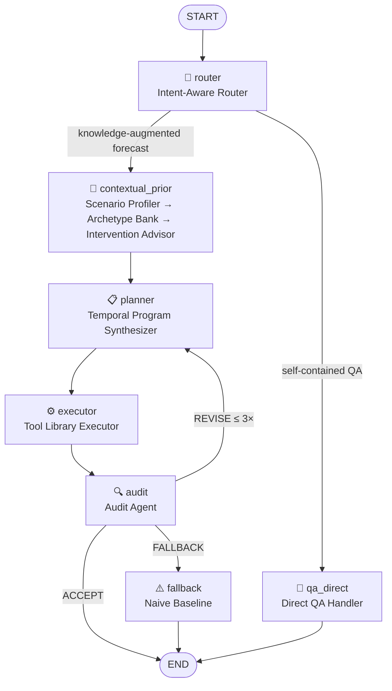

# TS-Agent

A LangGraph implementation of the ECLIPSE multi-agent pipeline for context-rich time-series forecasting and QA.

## Architecture

Five agents wired as a `StateGraph`, matching the ECLIPSE paper:



| Node | Role |
|------|------|
| `router` | Classifies task as `forecast` or `qa`, flags if knowledge-augmented |
| `contextual_prior` | Scenario profiler → Temporal Archetype Bank retrieval → Intervention Advisor |
| `planner` | Synthesizes temporal program Π = (hist\_ops, foundation\_forecast, future\_ops) |
| `executor` | Runs the tool library against the temporal program |
| `audit` | Returns ACCEPT / REVISE / FALLBACK; loops back to planner on REVISE |

## Setup

```bash
python -m venv .venv
# Windows
.venv\Scripts\pip install -e ".[dev]"
# macOS / Linux
.venv/bin/pip install -e ".[dev]"
```

Create a `.env` file (never committed):
```
OPENAI_API_KEY=sk-...
```

## Run

```bash
# Windows
$env:OPENAI_API_KEY = "sk-..."
.venv\Scripts\python example.py

# macOS / Linux
OPENAI_API_KEY=sk-... .venv/bin/python example.py
```

## Structure

```
ts_agent/
├── state.py                # TSAgentState TypedDict
├── graph.py                # StateGraph definition and compilation
├── nodes/
│   ├── router.py           # Intent-aware routing + direct QA handler
│   ├── prior.py            # Contextual Prior Agent (profiler → archetype bank → advisor)
│   ├── planner.py          # Temporal program synthesis
│   ├── executor.py         # Tool library execution
│   └── audit.py            # Audit + fallback
├── tools/
│   └── library.py          # Hist reconditioning, forecast stub, future enforcement ops
└── archetype_bank/
    ├── retrieval.py        # Bi-modal DTW + semantic retrieval via RRF
    └── bank.json           # Populate with medoid data to activate archetype retrieval
```

## Status

- [x] Full graph wiring and typed state
- [x] All five agent nodes with LLM structured output (gpt-4o)
- [x] Tool library (clip, impute, scale, trend, event spike/dip ops)
- [x] Archetype bank retrieval (DTW + RRF) — active once `bank.json` is populated
- [ ] Replace forecast stub with real foundation model (Moirai / Chronos / Lag-LLaMA)
- [ ] Wire semantic embeddings for archetype retrieval second channel
- [ ] Populate `bank.json` with medoid data
